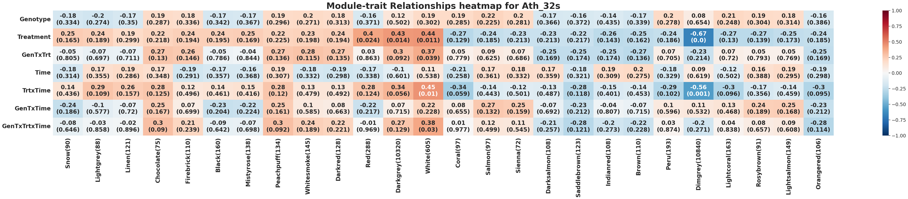
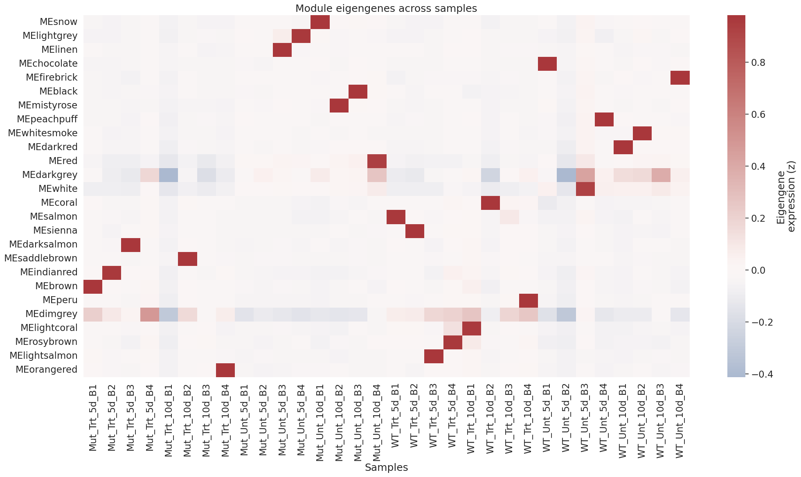

# PyWGCNA Pipeline for Gene expression (data from Dash et al., 2023)
### Module_trait_relationship_heatmap


### Module_Eigengenes_across_samples


---
This repository provides a complete, reproducible pipeline for **gene co-expression network analysis** using [PyWGCNA](https://pywgcna.readthedocs.io/). The workflow is demonstrated on a 16-sample, 2×2 experimental design (Genotype × Treatment) for *Arabidopsis thaliana*.

---

## Table of Contents

- [Overview](#overview)
- [Directory Structure](#directory-structure)
- [Requirements](#requirements)
- [Input Data Format](#input-data-format)
- [Pipeline Workflow](#pipeline-workflow)
  - [1. Load Data](#1-load-data)
  - [2. Wrap in GeneExp](#2-wrap-in-geneexp)
  - [3. Create WGCNA Object](#3-create-wgcna-object)
  - [4. Preprocess & Module Detection](#4-preprocess--module-detection)
  - [5. Visualize Soft-Thresholding](#5-visualize-soft-thresholding)
  - [6. Update Sample Info](#6-update-sample-info)
  - [7. Add Covariates](#7-add-covariates)
  - [8. Module-Trait Relationships](#8-module-trait-relationships)
  - [9. Extra Visualizations & Export](#9-extra-visualizations--export)
- [Outputs](#outputs)
- [Customization](#customization)
- [References](#references)
- [License](#license)
- [Contact](#contact)

---

## Overview

This pipeline performs the following:

- Loads gene expression, gene annotation, and sample metadata
- Preprocesses and filters the data
- Constructs a weighted gene co-expression network
- Detects gene modules (clusters)
- Relates modules to experimental traits
- Visualizes key results
- Exports gene-to-module assignments

---

## Directory Structure

| File/Folder                  | Description                                      |
|------------------------------|--------------------------------------------------|
| `expression_TPM.csv`         | Gene expression matrix (genes x samples)         |
| `gene_info.csv` *(optional)* | Gene annotation table                            |
| `sample_info.csv`            | Sample metadata (Genotype, Treatment, etc.)      |
| `WGCNA_results/`             | Output directory for results and figures         |
| `pywgcna_pipeline.py`        | Main analysis script                             |
| `README.md`                  | This documentation file                          |

---

## Requirements

- Python 3.7+
- [PyWGCNA](https://pywgcna.readthedocs.io/)
- pandas, numpy, matplotlib, seaborn, networkx, scipy

**Install dependencies:**

pip install pywgcna pandas numpy matplotlib seaborn networkx scipy

---

## Input Data Format

**1. Expression Matrix (`expression_TPM.csv`):**

| gene_id      | Sample1 | Sample2 | ... |
|--------------|---------|---------|-----|
| AT1G01010    | 5.1     | 3.2     | ... |
| AT1G01020    | 0.0     | 1.5     | ... |
| ...          | ...     | ...     | ... |

**2. Gene Annotation (`gene_info.csv`, optional):**

| gene_id      | description           | ... |
|--------------|----------------------|-----|
| AT1G01010    | Protein kinase       | ... |
| ...          | ...                  | ... |

**3. Sample Metadata (`sample_info.csv`):**

| sample_id | Genotype | Treatment | Time |
|-----------|----------|-----------|------|
| Sample1   | WT       | Unt       | T0   |
| Sample2   | Mut      | Trt       | T1   |
| ...       | ...      | ...       | ...  |

---

## Pipeline Workflow

Below is a detailed breakdown of each step in the pipeline, with code snippets and explanations.

---

### 1. Load Data

**Load expression, gene annotation, and sample metadata.**

```python
import os
import pandas as pd
from PyWGCNA.geneExp import GeneExp
from PyWGCNA.utils import getGeneList

expr_file        = "expression_TPM.csv"
geneinfo_file    = "gene_info.csv"
sampleinfo_file  = "sample_info.csv"
species          = "arabidopsis"
output_dir       = "WGCNA_results"

os.makedirs(output_dir, exist_ok=True)

# Load expression data
expr  = pd.read_csv(expr_file, index_col=0)

# Load gene annotation if available, else fetch from Ensembl Plants BioMart
if geneinfo_file and os.path.exists(geneinfo_file):
    ginfo = pd.read_csv(geneinfo_file, index_col=0)
else:
    ginfo = getGeneList(dataset = "athaliana_eg_gene",
                        server_domain = "http://plants.ensembl.org/biomart")
    ginfo = ginfo.set_index("gene_id").loc[expr.index].reset_index()

# Load and align sample annotation
sinfo = pd.read_csv(sampleinfo_file, index_col=0)
sinfo = sinfo.loc[expr.columns]
```

---

### 2. Wrap in GeneExp

**Organize the data for downstream WGCNA analysis.**

```python
from PyWGCNA.geneExp import GeneExp

geneExp = GeneExp(
    species     = species,
    level       = "gene",
    geneExp     = expr.T,         # Transpose: samples x genes
    geneInfo    = ginfo,
    sampleInfo  = sinfo
)
```

---

### 3. Create WGCNA Object

**Set up the WGCNA analysis with user-specified parameters.**

```python
from PyWGCNA.wgcna import WGCNA

wgcna = WGCNA(
    name           = "Ath_32s",
    species        = species,
    level          = "gene",
    geneExp        = expr.T,
    TPMcutoff      = 1,
    powers         = list(range(1,21)),
    RsquaredCut    = 0.85,
    MeanCut        = 100,
    networkType    = "signed hybrid",
    TOMType        = "signed",
    minModuleSize  = 40,
    MEDissThres    = 0.25,
    save           = True,
    outputPath     = output_dir,
    figureType     = "pdf"
)
```

---

### 4. Preprocess & Module Detection

**Filter, normalize, and cluster genes into modules.**

```python
print("STEP 1/4  Pre-processing …")
wgcna.preprocess(show=False)

print("STEP 2/4  Detecting modules …")
wgcna.findModules(kwargs_function={
    'cutreeHybrid': {'deepSplit': 2, 'pamRespectsDendro': False}
})
```

---

### 5. Visualize Soft-Thresholding

**Plot the scale-free topology fit to choose the optimal soft-thresholding power.**

```python
import matplotlib.pyplot as plt

FIGDIR = wgcna.outputPath

plt.figure(figsize=(5,4))
sft = wgcna.sft
plt.scatter(sft.Power, sft['SFT.R.sq'], c='k')
plt.axhline(0.85, ls='--', c='red')
plt.xlabel('Soft–threshold power')
plt.ylabel('Scale-free fit $R^{2}$')
plt.title('Scale-free topology fit')
plt.tight_layout()
plt.savefig(os.path.join(FIGDIR, 'soft_threshold_fit.pdf'))
plt.show()
```

---

### 6. Update Sample Info

**Ensure sample metadata is current in the WGCNA object.**

```python
wgcna.updateSampleInfo(sampleInfo = sinfo)
```

---

### 7. Add Covariates

**Attach experimental variables for trait analysis.**

```python
# Add experimental design variables
wgcna.datExpr.obs["Genotype"]      = sinfo["Genotype"].values
wgcna.datExpr.obs["Treatment"]     = sinfo["Treatment"].values
wgcna.datExpr.obs["Time"]          = sinfo["Time"].values
wgcna.datExpr.obs["GenTxTrt"]      = (sinfo["Genotype"] + "_" + sinfo["Treatment"]).values
wgcna.datExpr.obs["TrtxTime"]      = (sinfo["Treatment"] + "_" + sinfo["Time"]).values
wgcna.datExpr.obs["GenTxTime"]     = (sinfo["Genotype"] + "_" + sinfo["Time"]).values
wgcna.datExpr.obs["GenTxTrtxTime"] = (
    sinfo["Genotype"] + "_" + sinfo["Treatment"] + "_" + sinfo["Time"]).values

# Convert categorical variables to numeric codes
for col in ["Genotype", "Treatment", "GenTxTrt", "Time", "TrtxTime", "GenTxTime", "GenTxTrtxTime"]:
    wgcna.datExpr.obs[col] = (
        wgcna.datExpr.obs[col].astype("category").cat.codes
    )
```

---

### 8. Module-Trait Relationships

**Visualize correlation between modules and traits as a heatmap.**

```python
meta_cols = ["Genotype", "Treatment", "GenTxTrt", "Time", "TrtxTime", "GenTxTime", "GenTxTrtxTime"]
wgcna.module_trait_relationships_heatmap(
    meta_cols,
    alternative = "two-sided", figsize=(50, 10)
)
```

---

### 9. Extra Visualizations & Export

**Eigengene heatmap and export of gene-module assignments.**

```python
import seaborn as sns
import numpy as np

# Eigengene heatmap
if hasattr(wgcna, "MEs"):
    mes = wgcna.MEs.copy()
else:
    mes = wgcna.moduleEigengenes

sample_order = sinfo.sort_values(["Genotype", "Treatment"]).index
mes = mes.loc[sample_order]

plt.figure(figsize=(21, 12))
sns.heatmap(mes.T, cmap="vlag", center=0, cbar_kws=dict(label="Eigengene\nexpression (z)"))
plt.yticks(rotation=0)
plt.title("Module eigengenes across samples")
plt.xlabel("Samples")
plt.tight_layout()
plt.savefig(os.path.join(FIGDIR, "eigengene_heatmap.pdf"))
plt.show()

# Export gene-to-module assignments
from pathlib import Path

out_file = Path("WGCNA_results/gene_module_assignment.csv")
gene2mod = pd.DataFrame(pd.Series(
    wgcna.datExpr.var.moduleColors,
    index=wgcna.datExpr.var.index,
    name="Module"
))
gene2mod = gene2mod.merge(ginfo, left_on="gene_id", right_on="gene_id", how="left")
gene2mod.to_csv(out_file, index=False)
print(f"Gene–module table written to → {out_file.resolve()}")
```

---

## Outputs

- **Figures** (PDF):  
  - `soft_threshold_fit.pdf`: Soft-thresholding fit
  - `eigengene_heatmap.pdf`: Module eigengene heatmap
  - (Other figures as generated by PyWGCNA)
- **Tables**:  
  - `gene_module_assignment.csv`: Each gene’s module assignment (with optional annotation)

---

## Customization

- **Change species**: Edit the `species` variable in the script.
- **Adjust thresholds and parameters**: Modify WGCNA object arguments to suit your data.
- **Add/remove covariates**: Edit the covariate section to match your experimental design.

---

## References

- [PyWGCNA Documentation](https://pywgcna.readthedocs.io/)
- [WGCNA R Package](https://horvath.genetics.ucla.edu/html/CoexpressionNetwork/Rpackages/WGCNA/)

---

## License

This project is open-source and free to use under the MIT License.

---

## Contact

For questions or suggestions, please open an issue or contact the repository maintainer.

---

**Happy network analysis!**

---

Let me know if you want to add example images, troubleshooting, or more advanced usage!
